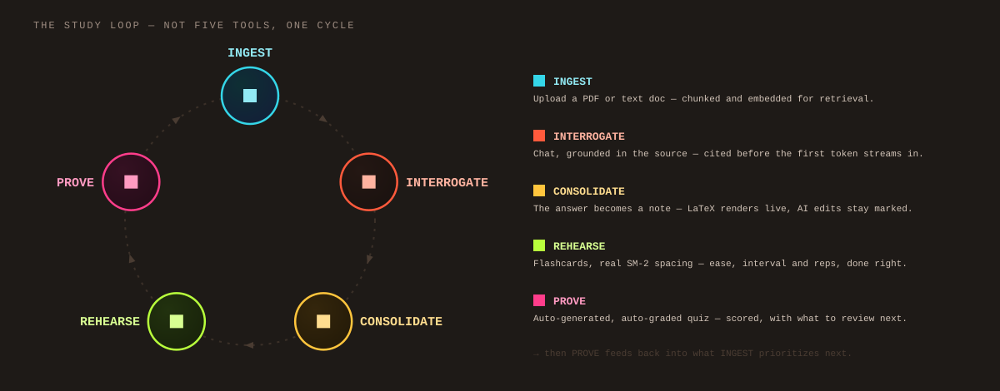
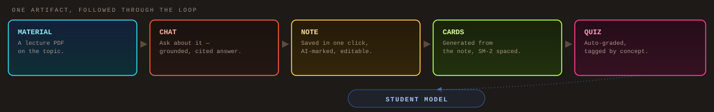
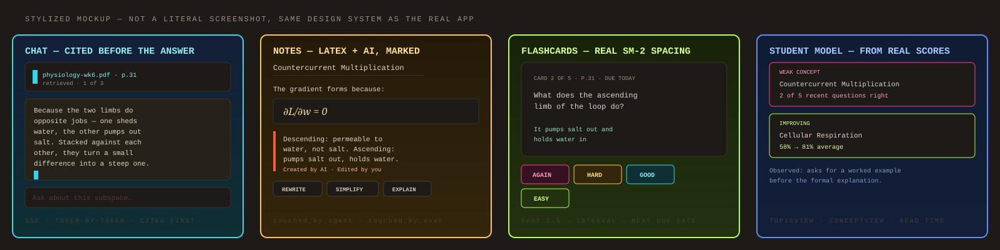
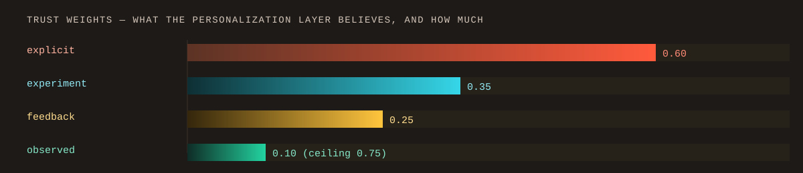
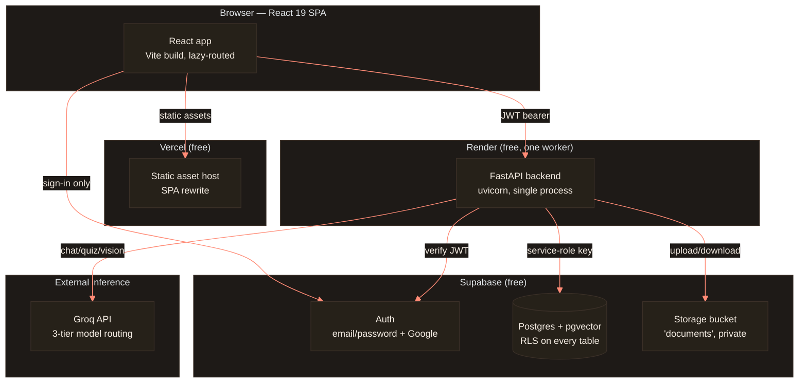
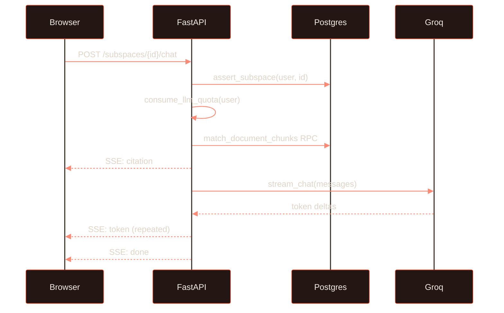

<div align="center">


**A study app designed not to make things up — every grounded answer is
cited back to the page it came from, and becomes a note, a flashcard, or a
quiz in one click.**

[](LICENSE)
[](web/package.json)
[](web/package.json)
[](api/pyproject.toml)

A full production app, not a prototype — **58 API routes**, **720 passing
tests**, **$0 infrastructure** on free hosting tiers (inference cost scales
with usage).

</div>

<br/>

Built for students who study from their own material — lecture PDFs, course
notes, papers — where studying is one continuous loop, not five disconnected
tools: what you upload becomes what you ask, what you ask becomes what you
keep, and what you keep is what you're tested on. Organized as
**Subjects → Subspaces**, so the AI is never guessing which class you mean,
and a failed retrieval stays a handled state instead of turning into a
hallucinated answer.

<br/>

<div align="center">

</div>

<sub>Five stages, one cycle — the Student Model at center is the feedback
layer, not a sixth stage.</sub>

<br/>

Every card above is a real feature, not a diagram aspiration — a chat answer
becomes a note in one click, a note becomes flashcards, a quiz is generated
from whatever the student actually studied. Followed through as one thread:

<div align="center">

</div>

<sub>Student Model sits outside the five artifact stages — it reads the
result, it isn't one.</sub>

**If that's the kind of engineering you'd want on your team, the receipts are
below — real guard code, real spaced-repetition math, real measured
latency, not adjectives.** ⭐ a star goes a long way.

<details>
<summary><b>Contents</b></summary>

- [What it looks like](#what-it-looks-like)
- [Highlights](#whats-actually-in-it)
- [Proof, not claims](#proof-not-claims)
- [Where SpaceLearn is intentionally different](#where-spacelearn-is-intentionally-different)
- [What makes this technically interesting](#what-makes-this-technically-interesting)
- [AI Agents & custom Skills](#ai-agents--custom-skills)
- [Design system](#design-system-foil-binder)
- [Architecture](#architecture)
- [The AI pipeline](#the-ai-pipeline)
- [Personalization](#the-student-model--personalization)
- [Engineering deep-dive](#engineering-decisions-worth-reading)
- [What we actually built](#what-we-actually-built)
- [Tech stack](#tech-stack)
- [Trade-offs I chose deliberately](#trade-offs-i-chose-deliberately)
- [Quick start / one-click deploy](#quick-start)
- [Testing](#testing)
- [Project structure](#project-structure)
- [Full documentation](#full-documentation)
- [Contributing](#contributing)

</details>

## What it looks like



<sub>Stylized mockup, not a screenshot — a real 30–40s walkthrough (upload →
grounded chat → citation → note → cards/quiz → review) replaces this once
it's recorded.</sub>

## What's actually in it

- **Chat, grounded in your own documents** — pgvector retrieval, streamed
  token-by-token, with citation cards that render *before* the first token
  and link straight to the source page.
- **A real rich-text note editor** — Tiptap-based, with live LaTeX rendering
  (KaTeX) and a from-scratch fix for a CommonMark parser bug that silently
  ate backslashes on save (more in [Engineering decisions](#engineering-decisions-worth-reading)).
- **AI that writes *in* the note, not just *about* it** — inline `/ai` and
  selection actions (Rewrite, Simplify, Explain), with provenance tracking
  (`touched_by_user` / `touched_by_agent` — independent, since a note can
  legitimately be both).
- **Spaced-repetition flashcards** — real SM-2, implemented twice (server +
  client) and kept honest by a parity test (see [Proof](#proof-not-claims)).
- **Auto-generated, auto-graded quizzes** — topic-scoped, with every
  question tagged with a concept at generation time, feeding weak-area
  detection with no extra pipeline.
- **A student model derived from data** — weak-topic and weak-concept
  detection from real quiz scores, not account age (see
  [The Student Model](#the-student-model--personalization)).
- **Account-wide libraries** — Notes/Cards/Quizzes are reachable from
  anywhere, not locked to the topic they were created in.
- **Onboarding that feeds the model** — a short intake quiz seeds the
  student model's explicit layer before any behavior exists to observe.
- **Settings that don't lie** — every control is live-wired to something
  real; a fake toggle was removed rather than shipped, on principle.

## Proof, not claims

Three things that are easy to say about a codebase and hard to actually show.

**The application layer is the real authorization boundary, not the
database.** The backend runs on a service-role key that bypasses Postgres
RLS entirely, so ownership is enforced in code — either by a shared
`assert_*` guard or by scoping the query itself to `user_id = <caller>`.
Verbatim, `api/app/guards.py`:

```python
async def assert_subspace(user_id: str, subspace_id: str) -> dict:
    """Return the subspace row (with its parent subject's name embedded, as
    `row["subjects"]["name"]`), or 404 if it isn't this user's."""
    rows = await supabase.db_select(
        "subspaces",
        filters={"user_id": f"eq.{user_id}", "id": f"eq.{subspace_id}"},
        select="*,subjects(name)",
        limit=1,
    )
    if not rows:
        # 404 rather than 403: don't confirm that someone else's id exists.
        raise NotFound("Subspace not found.")
    return rows[0]
```

Of the 38 routes that accept a caller-supplied resource id, every one proves
ownership before touching the row — 24 call a guard like this one, the rest
scope their own query to `user_id = <caller>` instead, which PostgREST
enforces server-side. `test_guard_coverage.py` checks both paths and fails
the test suite if a new route does neither.

**Spaced repetition, the real SM-2 arithmetic** — implemented twice
(Python server, TypeScript client) and kept honest by a 480-case parity
test. Verbatim, `api/app/routers/flashcards.py`:

```python
if body.grade == "again":
    ease = max(1.3, ease - 0.2)
    interval = 1
    reps = 0
elif body.grade == "hard":
    ease = max(1.3, ease - 0.15)
    interval = max(1, int(round(interval * 1.2)))
    reps += 1
elif body.grade == "good":
    interval = max(1, int(round(interval * ease))) if reps > 0 else 1
    reps += 1
else:  # easy
    ease = ease + 0.15
    interval = max(2, int(round((interval or 1) * ease * 1.3)))
    reps += 1
```

A wrong answer doesn't just shorten the interval — it resets `reps` to 0,
so the card re-enters the learning phase instead of repeating on a shorter
clock.

**Personalization has real, weighted trust levels — not one bucket.**

<div align="center">

</div>

<sub>Higher weight = stronger evidence for personalization.</sub>

Per the project's own decision log: *"contradicting evidence outweighs
confirming evidence 1.5:1 — being wrong about a student costs more than
being unsure about them."*

**Built, not mocked** — the same claims, as a scoreboard:

| | |
|---|---|
| **Security** | 38 owned-id routes, every one ownership-checked, anti-enumeration 404s |
| **Retrieval** | Local BGE-small + pgvector — Recall@5 0.944, MRR 0.713 |
| **Performance** | ~699ms chat time-to-first-token, ~158KB entry bundle |
| **Correctness** | SM-2 implemented twice, kept honest by a 480-case parity test |
| **Cost** | $0 infra — Vercel + Render + Supabase free tiers; inference scales with usage |

## Where SpaceLearn is intentionally different

Not a knock on any of these — they're good at what they do, and how you use
either one depends heavily on setup. This is what Space Learn is built
*around*, by default, without extra configuration:

| | Space Learn | General AI chat | Spaced-repetition tools |
|---|:---:|:---:|:---:|
| Cites the source page before the answer | ✅ | depends on setup | — |
| Chat → note → cards → quiz, one workspace | ✅ | manual copy-paste | manual entry |
| SM-2 spaced repetition, built in | ✅ | — | ✅ (that's their job) |
| Weak-topic detection from your own quiz scores | ✅ | — | limited |
| Self-hostable on free infra tiers | ✅ | varies | varies |

## What makes this technically interesting

The short version, for anyone who doesn't want to read the next ten sections
to find it:

- **[Grounded retrieval](#the-ai-pipeline)** — local BGE-small → pgvector →
  citation-integrity validation, not a raw prompt-and-hope.
- **[An adaptive learning model](#the-student-model--personalization)** —
  quiz evidence turns into weak-topic and weak-concept detection, which
  becomes personalized AI context, all derived at read time from data that
  already exists.
- **[Sandboxed user-authored Skills](#ai-agents--custom-skills)** —
  untrusted prompt injection turned into a controlled feature, positioned so
  it can't outrank the app's own grounding rules.
- **[Correctness that survives two runtimes](#proof-not-claims)** — SM-2
  spaced repetition implemented independently in Python and TypeScript, kept
  honest by a 480-case parity test.
- **[Free-tier architecture discipline](#trade-offs-i-chose-deliberately)**
  — a single-worker backend, local embeddings, and a hand-rolled data
  client, each a deliberate trade-off, not a corner cut by accident.

## AI Agents & custom Skills

Two different senses of "agent" in this app, both real, both load-bearing:

**1. The Notes agent.** Every note carries an `origin` (`user` / `agent` /
`doc`) *and* two independent booleans — `touched_by_user`, `touched_by_agent`
— tracking who has actually touched the content since, not just who created
it. An AI-written note you later edit is `touched_by_agent: true,
touched_by_user: true` at once, on purpose: the UI's "AI"/"Mine" filters
aren't a partition of "All", they're two independent questions, and the
provenance label (`Created by AI · Edited by you`) says exactly what
happened, once, instead of pretending one side owns the note.

**2. Skills — user-authored, sandboxed agent personas.** A Skill is a
reusable system-prompt behavior ("Socratic Tutor," "Code Review Mentor," or
one you write yourself) that can be scoped to remember a single session, one
topic, or everything — and multiple can be active on one subspace at once
(ordered `created_at.asc`, so the newest activation wins a real conflict).
10 seeded **library Skills** are globally readable but unwritable (RLS
two-tier policy: `user_id = auth.uid() OR is_library`), so every account
starts with working examples, not a blank text box.

The interesting engineering part is the **sandbox, not the feature**: a
Skill's raw text is user-authored and untrusted the same way a document
upload is. It's wrapped in a `<teaching-style>` delimiter before it ever
reaches the model, and it sits **mid-prompt**, with the product's own honesty
and safety rules placed *after* it — because a model reads the last
constraint as the most specific, a careless Skill ("always cite a source,"
say) previously could — and once actually did — outrank the app's own
grounding rules by sitting last. Fixed by re-ordering the prompt, not by
restricting what a Skill can say. See
[The AI Pipeline](#the-ai-pipeline) for the full assembly order.

## Design system: "Foil Binder"

Not a default theme — a deliberate world, and the seven squares in the banner
above are it, not decoration. Dark-only, warm ground (`#1e1a17`), no violet
anywhere (explicitly banned mid-redesign). The seven foil tones double as both
a subject's color identity *and* a badge's rarity tier — the same system does
two jobs. Every card-shaped surface in the app (a flashcard, a deck tile, a
badge) is built on one shared `cardstock` treatment. 50+ icons are hand-drawn
SVG paths (`components/ui/Icon.tsx`) — zero emoji anywhere in the product UI.
The landing page is one continuous scroll-driven scene rather than a stack of
sections, with a single fixed light source instead of a per-section gradient,
specifically to avoid the seams that make a landing page read as slides.

## Architecture



**The one rule that explains most of this diagram:** the browser never talks
to Postgres or Groq directly. Every privileged operation funnels through the
backend, which is the only thing holding real credentials — a security
boundary first, an architecture choice second.

<details>
<summary><b>A chat turn, sequenced</b> — the highest-traffic request in the app</summary>



Citations are computed **before** the model call and streamed first — the
frontend renders source cards while the answer is still arriving, and
retrieval failure is handled as its own state rather than silently degrading
into a hallucinated answer.

</details>

## The AI pipeline

`api/app/services/rag.py`, `guardrails.py`, `embeddings.py` —
[full write-up](docs/engineering/ai-pipeline.md).

Under the hood, every chat request is one path, in this order:

```
Request → Ownership → Retrieval → Grounding → Skills → Personalization → Integrity → Stream
```

> No evidence → no fake certainty. A failed retrieval stays a handled state,
> not a hallucinated answer.

- **Chunking**: 900-char windows (~200 tokens), 120-char overlap, boundary-aware
  — prefers a paragraph break, falls back to sentence-ish punctuation, so a
  chunk never cuts mid-word.
- **Embeddings**: local BGE-small-en-v1.5, quantized ONNX via `fastembed` —
  no external embedding API, ~170–230MB resident. `vector(384)` storage
  (~1.5KB/row) fits roughly **210,000 chunks** — ~4,200 lecture PDFs — before
  Supabase's 500MB free-tier ceiling.
- **Retrieval**: `retrieve()` embeds the question, calls the
  `match_document_chunks` RPC (cosine similarity, top-k=4), and
  `retrieve_with_links()` additively pulls from any explicitly **linked**
  subspaces the student has connected — never automatic, always opt-in.
- **Prompt assembly order is deliberate, not incidental**: voice → topic →
  response-shape → diagram rule → citation-format instruction → *"answer
  only from documents"* → the sandboxed Skill block → student personalization
  → **integrity rules last** → **safety rules last**. A model reads the last
  constraint as the most specific — this ordering is the actual fix for a
  real bug where a user-authored Skill could outrank the app's own grounding
  rules.
- **Citation integrity**: after the full stream completes, a regex strips any
  `[[n]]` marker that doesn't resolve to a real source — "a marker that
  resolves to nothing reads as a broken promise," and running it post-stream
  costs nothing on time-to-first-token.
- **Vision guardrail**: text found *inside* an uploaded image is treated as
  content to describe, never as an instruction — closing the injection
  surface where a screenshot could contain "ignore your instructions" as
  pixels. SVG is excluded from allowed image types specifically because it
  can carry a script.
- **Safety rules are deliberately narrow**: the model refuses only
  *operational* assistance (a weapon/poison synthesis route, an attack on a
  named target, a self-harm method) — never academic subject matter
  (pathogens, drugs, exploits, historical atrocities), because an
  over-refusing tutor is both a worse product *and* a worse safety outcome in
  an education context.
- **Measured retrieval quality** (real corpus, not synthetic): **Recall@5
  0.944, MRR 0.713**.

## The student model & personalization

`api/app/services/student_model.py` (906 lines), `personalization.py` —
[full write-up](docs/engineering/personalization.md).

Two units of analysis, both derived at read time from data that already
exists — **no extra pipeline, no scheduled job**:

- **`TopicView`** (one per subspace) — quiz average, a **trend** computed as
  later-half minus earlier-half average (not first-vs-last, since a
  5-question quiz swings ~20 points per question), days since activity, and
  cards due. A topic only goes "cold" after **10 days** idle — a student who
  studies only on Sundays shouldn't get flagged on a Tuesday.
- **`ConceptView`** (finer-grained) — joined from data that already existed:
  each quiz question's LLM-tagged `subtopic` × the student's chosen answer.
  "It needed someone to do the join," not a schema change. A concept needs
  **3+ questions** before its accuracy means anything (below that, "a coin
  flip with extra steps"), and **<60% accuracy** flags it weak.

Illustrative, not a real captured session — but this is the shape of what
falls out of those two views once a student has a few quizzes in:

> **Weak concept** — *countercurrent multiplication*, 2 of 5 recent
> questions right.
> **Improving** — *cellular respiration*, up from 58% to 81% average.
> **Observed** — *tends to ask for a worked example after the first
> explanation, on 6 of the last 9 sessions.*

**One read pass, not six.** `snapshot()` used to be called independently by
chat, quiz generation, flashcard generation, the notes agent, inline `/ai`,
and the daily brief — six near-identical fetches of `quiz_results` /
`daily_activity` / `subspaces` per page load. Now it's one function
(~10–12 concurrent selects, or a single RPC when available) feeding a
**per-task context builder**, each with a stated token budget (~6 lines) —
chat gets *only* what's relevant to answering right now, deliberately
excluding streaks, badges, and other subjects' state it can't act on anyway.

**Preferences fold, with real, weighted trust levels** — a closed whitelist
of 8 modelable dimensions (explanation length/depth, session length, study
goal, …), each blended from four sources with different trust (chart in
[Proof, not claims](#proof-not-claims) above). Observed-habit sentences
("works mostly by asking questions on 7 of the last 12 active days") are
always labeled as observed, never phrased as fact — *"a model may propose
but may never assert."*

<details>
<summary><b>Engineering deep-dive</b> — decisions, code discipline, security, performance, roadmap</summary>

### Engineering decisions worth reading

The parts of this codebase that took actual judgment, not just typing:

| Decision | The problem it solves | The cost accepted |
|---|---|---|
| **Guards, not RLS, are the real authorization boundary** | The backend uses Supabase's service-role key, which bypasses Row Level Security entirely — so every route accepting a caller-supplied id (`subspace_id`, `deck_id`, …) either calls a shared `assert_*` helper or scopes its own query to `user_id = <caller>` *before* touching the row. RLS still exists as defense-in-depth, but it isn't what's actually stopping a cross-user read. A dedicated `test_guard_coverage.py` fails the test suite if a new endpoint does neither. | A missed check is a silent leak, not a loud RLS error — discipline (and tests) matter more than the framework. |
| **A concept is a normalized tag, never a stored row** | `normalize(t) = trim(t).lower()` on data already sitting in existing tables (a quiz question's `subtopic`), aggregated with `GROUP BY` at read time. An entire concepts/concept-graph schema proposal was rejected — twice, once when it crept back in under a different name — in favor of this. | No graph database, no NLP resolution pipeline, no schema migration when the model's tagging vocabulary drifts — but concept matching is exact-string, not semantic. |
| **One Groq key, three model tiers** | Chat/quiz generation don't need the same model as a short low-stakes prompt (like the daily brief) — routing by request avoids paying 70B-class latency and quota for work an 8B model handles fine. | An extra layer of indirection (`llm.py`'s `LLM` protocol) that has to stay provider-agnostic. |
| **No background workers, on purpose** | Render's free tier gives 512MB RAM and spins down after 15 minutes idle — a queue-based embedding pipeline would need infrastructure the free tier can't run reliably. Document embedding runs inline, capped at 25s, with a `reprocess` endpoint for the timeout case. | Nothing runs "later" — every embed either finishes in-request or gets a second chance on demand, never silently in the background. |
| **BGE-M3 evaluated and rejected for production embeddings** | Its weights alone (~2.2GB) are 4× the entire 512MB memory ceiling — kept only as an offline quality benchmark against the BGE-small model actually shipped. | A measurably smaller quality ceiling, traded for the app being able to run on a free instance at all. |
| **A hand-rolled `httpx`-based Supabase client**, not the official SDK | Measurably smaller memory footprint on a 512MB instance — the reason the free tier survives at all. | More code to maintain in `services/supabase.py`; no SDK convenience methods. |
| **LaTeX backslash preservation, diagnosed from the actual parser source** | Notes round-trip through a CommonMark markdown parser, which silently consumes a backslash before punctuation (`\[`, `\)`) while leaving backslash-before-letter (`\sin`) alone. Root-caused by reading `prosemirror-markdown`'s actual `esc()` implementation, not guessed — the fix is scoped to `!touched_by_user` (never-yet-saved AI text) specifically so it can't double-escape an already-correct note on repeat saves. | A subtle invariant that has to be understood, not just pattern-matched, before touching that code path again. |
| **A cache-invalidation race, root-caused instead of patched per call site** | An optimistic `setData(prev => [...prev, created])` call could read a `prev` that had *already* been invalidated by the same mutation's own synchronous cache-clear — silently turning "append" into "replace with just the new item" across every screen using the shared `useAsync` hook. Fixed once, at the hook, with a ref tracking the last rendered value as a fallback. | None — this is what a shared hook is for. Fixing it per screen would have meant fixing it five times and missing a sixth. |

Full write-ups (data model, request-authorization flow, error-handling
contract, free-tier discipline, trade-offs table, scalability roadmap) live in
[`docs/engineering/architecture.md`](docs/engineering/architecture.md) and
[`docs/decisions.md`](docs/decisions.md).

### Code quality & engineering discipline

Not claims — every line below is a real, checkable mechanism in this repo,
not a description of intent.

- **A test fails if you forget a security check.**
  [`test_guard_coverage.py`](api/tests/test_guard_coverage.py) doesn't test
  one endpoint — it inspects every router and asserts each one that accepts
  a caller-supplied id either calls an `assert_*` ownership guard (guard
  code in [Proof, not claims](#proof-not-claims) above) or scopes its own
  query to the caller's `user_id`. A new endpoint that does neither doesn't
  get caught by a human reviewer noticing; it gets caught by the test suite,
  every time.
- **One error shape, everywhere.** Every backend error — expected or not —
  returns the identical envelope: `{"error": {"code", "message"}}`. No raw
  exception, stack trace, or upstream provider error body is ever allowed to
  reach the screen; the frontend's `friendlyMessage()` maps every code to
  plain-English copy in exactly one place.
- **Correctness that survives two languages.** SM-2 grading (arithmetic
  above) is implemented independently in Python (server) and TypeScript
  (client, for optimistic UI), and a dedicated parity test runs 480 real
  cases through both and diffs the output — not "we wrote it twice and
  hoped," a test that fails if they ever disagree.
- **Root-cause fixes over per-symptom patches**, evidenced twice above: the
  `useAsync` cache race was fixed once, at the shared hook, instead of
  patched at every screen that hit it; the LaTeX backslash bug was diagnosed
  by reading `prosemirror-markdown`'s actual serializer source rather than
  pattern-matched from the symptom, which is why the fix is scoped precisely
  (`!touched_by_user`) instead of applied everywhere and quietly
  double-escaping already-correct notes.
- **Shared primitives, not copy-pasted UI.** Every delete confirmation in the
  app — Docs, Notes, Skills, Cards, Spaces — routes through one
  `ConfirmDialog` component and one `loading` prop; every dropdown routes
  through one keyboard-accessible `Select`; every modal inherits focus-trap,
  Escape-to-close, and focus restoration from one `Modal`. A behavior fixed
  once is fixed everywhere it's used.
- **Compiler flags earn their keep**: `noUnusedLocals`, `noUnusedParameters`,
  `noFallthroughCasesInSwitch`, and `verbatimModuleSyntax` are on
  (`tsconfig.app.json`) — real dead-code and fallthrough-bug prevention, not
  a blanket `strict: true` flipped on and never tuned.
- **Linting**: `oxlint` (Rust-based, frontend) and `ruff` (backend) — zero
  errors on the current tree; the ~20 remaining warnings are
  `react-refresh` advisories (a file intentionally exporting a small helper
  alongside a component) and two `exhaustive-deps` notes on a ref accessed
  inside a cleanup function, each reviewed and left as-is on purpose, not
  unnoticed.
- **Migrations are additive-only.** 18 timestamped SQL files in
  `supabase/migrations/` — an already-applied migration is never edited,
  only superseded by a new one. History stays honest about what actually ran
  in production, in order.
- **A living decision log**, not a wiki that rotted. `docs/decisions.md`
  records *why* the big calls were made — including the ones that were tried
  and rejected (an entire concept-graph schema proposed and rejected twice,
  the abandoned parallel-DB-call optimization that measured slower) — so the
  reasoning survives past the person who made the call.

### Security

[Full write-up](docs/engineering/security.md).

- **Every ownership guard returns 404, not 403**, on a foreign id —
  deliberately anti-enumeration, so a request can't distinguish "doesn't
  exist" from "exists but isn't yours." See the guard function above.
- **Dual-path JWT verification**: local HS256 (no network hop, preferred),
  falling back to a network call for projects on newer asymmetric signing
  keys — the fallback is cached 60s, since it was measured as the single
  largest latency cost in a page load with many verification hops.
- **Uploads**: 20MB cap, ownership guard before write, **server-constructed
  storage paths** (`{user_id}/{doc_id}/{filename}`) so a crafted filename
  can't path-traverse out of a user's folder, and extraction failures are
  stored as fixed, safe strings — never `str(e)` — so an exception can never
  leak to the screen.
- **Rate limiting**: an in-process token bucket, 20 burst / 20 per minute
  refill; chat costs 1 token, generation (quiz/card/note) costs 2 — framed
  explicitly as a spend cap on Groq quota, not just abuse prevention.
- **Prompt-injection blast radius is small by construction**: retrieval is
  subspace-scoped with exactly one owner, so a poisoned document can only
  ever affect its own uploader's own chat — and the backend exposes **no
  tool-calling, no shell, no arbitrary HTTP** to the model. A successful
  injection can change what the model *says*; it cannot make the model *do*
  anything.
- **API docs gated**: `/docs`, `/redoc`, and the OpenAPI schema are behind an
  `EXPOSE_API_DOCS` flag, off in production.

### Performance & cost, real numbers

Measured against the live app, not estimated — full detail in
[`docs/operations/performance-and-cost.md`](docs/operations/performance-and-cost.md).

| Metric | Measured | Budget |
|---|---|---|
| Chat time-to-first-token | **~699ms** (retrieval 512ms + Groq TTFT 187ms) | < 1.5s |
| Retrieval (`k=4`, 10-run median) | **512–521ms** | — |
| Retrieval quality (real corpus) | **Recall@5 0.944, MRR 0.713** | — |
| Document reprocess (52 chunks) | **~6.0s median** | < 8s target, 25s hard cap |
| First-load JS bundle (entry) | **~158KB gzipped** (down from 451KB pre-split) | 250KB self-imposed ceiling |
| Cost per student / month | **well under $1** (20 sessions, 10 turns each) | — |
| Projected cost at ~1,000 users | **~$300–500/month**, dominated by chat | — |
| Total infra cost today | **$0/month** (Vercel + Render + Supabase free tiers) | — |

One deliberately-kept "failed optimization" story: parallelizing 4 database
calls in the spaces-list endpoint measured **slower** (1566ms gathered vs.
1114ms sequential) due to TLS handshake overhead on a remote Postgres
connection — reverted, and left in the codebase as a documented
anti-pattern-in-context rather than quietly deleted.

### What's next

Designed in real detail in
[`docs/product/vision.md`](docs/product/vision.md), not yet shipped —
honesty about scope is a feature, not an omission:

- **The Gap Map** — a per-subject weak-area graph, computed at render time
  and never stored: node = concept, size = how much material covers it,
  color = current recall strength, edge = a confusion pair between two
  concepts pulled from the same wrong quiz answer. Explicitly rejected: a
  dedicated concepts/concept-graph schema, LLM-driven entity extraction, or
  any persisted graph — "a syllabus is a list; an exam is a graph," but the
  graph is *derived*, not owned.
- **Confusion pairs** — tagging each quiz *choice* (not just the question)
  with a concept, to aggregate real "you've mixed up X and Y four times"
  signal. Rated the highest pitch-value-to-effort item in the roadmap.
- **Exam-aware scheduling** — an `exam_date` on a subject that compresses
  SM-2's interval math to fit the actual runway remaining.
- **Explicitly rejected, permanently**: social/sharing features, a mobile
  app, real-time collaboration, and — per the product's own principle —
  *"gamification beyond honest streaks."* No XP, no leagues, no inflated
  numbers.

</details>

<div align="center">

</div>

## What we actually built

Not just wiring libraries together. The tech stack below is *where* — this
is *what*:

| | |
|---|---|
| **Frontend engineering** | Shared UI primitives (`Modal`, `Select`, `ConfirmDialog`), a rich-text editor with live LaTeX, token-by-token streaming UI, a scroll-driven landing scene, 50+ hand-drawn icons |
| **Backend engineering** | Async FastAPI services, a shared ownership-guard pattern enforced by a dedicated coverage test, an in-process rate limiter, a hand-rolled Supabase client for memory discipline |
| **AI engineering** | Local embedding inference, retrieval + citation-integrity checking, deliberate prompt-assembly ordering, a sandboxed user-authored-Skill system, structured quiz/card generation |

## Tech stack


| | |
|---|---|
| **Frontend** | React 19, TypeScript, Vite, Tailwind CSS v4, Tiptap 3 (rich text), KaTeX, react-markdown, GSAP + Lenis (motion/scroll) |
| **Backend** | FastAPI (async, single-worker), Pydantic v2, httpx, `python-jose` (JWT), `fastembed` (local ONNX embeddings — no external embedding API) |
| **Data** | Supabase (Postgres + pgvector + Row Level Security + Auth + Storage) |
| **Inference** | Groq — three model tiers routed per request |
| **Testing** | Vitest + Testing Library (430 frontend tests), pytest (290 backend tests) |
| **Hosting** | Vercel (frontend, static) · Render (backend, free tier) · Supabase (data, free tier) — infra runs on $0/month; inference cost scales with usage |

## Trade-offs I chose deliberately

Not a roadmap item — a real cost accepted for each, not an oversight:

- **Single backend worker**, not a queue. Render's free tier gives one
  process; there's no horizontal scaling yet, and a slow request can queue
  behind others. Accepted to stay on $0 infra.
- **An in-process rate limiter, not a shared one.** Resets on every
  redeploy — fine for one backend instance, wrong the moment there's more
  than one.
- **Exact-string concept matching, not semantic.** `"the mitochondria"` and
  `"mitochondria"` are two different concepts today. No NLP resolution
  pipeline, no schema migration when the tagging vocabulary drifts — but a
  drift quietly diverges weak-area data until it's normalized by hand.
- **The student model needs evidence before it says anything.** `ConceptView`
  requires 3+ questions before reporting an accuracy — a handful of answers
  isn't signal, it's noise.
- **BGE-small over BGE-M3.** BGE-M3 measured better in isolation but its
  weights alone are 4× the entire 512MB memory ceiling. Chosen to fit the
  free tier, not to maximize retrieval quality.

## Quick start

Deploy your own copy directly, no local setup — you'll still need a free
Supabase project and Groq key to configure after deploying:

[](https://vercel.com/new/clone?repository-url=https%3A%2F%2Fgithub.com%2FAbiram116%2FNew-Space-Learn&root-directory=web&project-name=space-learn)
[](https://render.com/deploy?repo=https://github.com/Abiram116/New-Space-Learn)

Or run it locally:

**Prerequisites:** a recent Node.js LTS, Python 3.11–3.12, a free
[Supabase](https://supabase.com) project, a free
[Groq](https://console.groq.com) API key.

```bash
git clone https://github.com/Abiram116/New-Space-Learn.git
cd New-Space-Learn

cp .env.example .env       # fill in Supabase + Groq keys
npm run dev                # starts backend + frontend together
```

That's it — `npm run dev` (from the repo root) runs both the FastAPI backend
and the Vite dev server concurrently. The frontend gracefully degrades if a
key is missing: unconfigured AI shows a friendly canned-reply stub instead of
a blank screen or a crash, so the UI stays fully clickable while you finish
setup.

See [`docs/operations/setup.md`](docs/operations/setup.md) for the full
walkthrough — Supabase project creation, running migrations, Google OAuth
config, and deploying to Render + Vercel.

## Testing

```bash
cd web && npm test          # 430 frontend tests — Vitest + Testing Library
cd api && pytest            # 290 backend tests — pytest + pytest-asyncio
```

No mocked-database shortcuts on the paths that matter: authorization guards,
RAG retrieval, and the SM-2 grading arithmetic are all tested against real
logic, not stubs standing in for it. A dedicated `test_guard_coverage.py`
fails the test suite outright if a new endpoint accepts a caller-supplied id
without proving ownership — a guard call or a `user_id`-scoped query.

## Project structure

```
web/         React 19 + Vite + TS + Tailwind v4        → Vercel
api/         FastAPI + async, module-level singletons   → Render (free tier)
supabase/    Postgres + pgvector + RLS migrations        → Supabase
docs/        Architecture, decisions, setup, product plan
render.yaml  Backend deploy manifest
```

<details>
<summary><b>Repo tour</b> — one line per folder that matters</summary>

- **`web/src/api/`** — the only place that talks HTTP; one file per resource.
- **`web/src/components/ui/`** — small primitives with no app-specific logic
  (`Button`, `Modal`, `Select`, `Toast`, `Icon`, …).
- **`web/src/features/`** — 14 feature areas, one folder each: `auth`,
  `chat`, `docs`, `flashcards`, `home`, `landing`, `notes`, `onboarding`,
  `profile`, `quizzes`, `settings`, `skills`, `spaces`, `transitions`.
- **`api/app/routers/`** — one file per domain; every handler is `async` and
  every error goes through one shared JSON envelope
  (`{"error": {"code", "message"}}` — no raw exception ever reaches the
  screen).
- **`api/app/services/`** — `rag.py`, `guardrails.py`, `embeddings.py`
  (the AI pipeline), `student_model.py`, `personalization.py` (the
  student model), `activity.py`, `streaks.py` (gamification), `llm.py`
  (provider abstraction), `supabase.py` (the hand-rolled data client).
- **`api/app/guards.py`** — the ownership-assertion helpers most routers call
  before touching a caller-supplied row id; the rest scope their own query
  to the caller instead.
- **`supabase/migrations/`** — 18 files, timestamped and additive-only;
  never edit an already-applied migration.

</details>

## Full documentation

- [**architecture.md**](docs/engineering/architecture.md) — how the pieces
  fit together, the data model, the AI layer, the design system, trade-offs
  stated explicitly, and a scalability roadmap ordered by which limit breaks
  first.
- [**ai-pipeline.md**](docs/engineering/ai-pipeline.md) — retrieval, chunking,
  prompt assembly, and guardrails in full depth.
- [**personalization.md**](docs/engineering/personalization.md) — the student
  model's data model and the preference-fold weighting in full.
- [**security.md**](docs/engineering/security.md) — the full threat model and
  what's explicitly out of scope today.
- [**decisions.md**](docs/decisions.md) — why the big choices were made,
  including what was rejected and why.
- [**performance-and-cost.md**](docs/operations/performance-and-cost.md) —
  every number above, with the methodology behind it.
- [**setup.md**](docs/operations/setup.md) — local dev, Supabase, Render,
  Vercel, end to end.
- [**product/vision.md**](docs/product/vision.md) — the product thesis and
  the full roadmap, built and unbuilt.
- [**plan.md**](docs/plan.md) — what's left to build, in what order.

## Contributing

Before a PR: `npm test` and `pytest` pass, `oxlint` / `ruff` are clean, and a
new caller-supplied-id endpoint proves ownership — an `assert_*` guard or a
`user_id`-scoped query (`test_guard_coverage.py` enforces this). A change
worth explaining gets a line in [`docs/decisions.md`](docs/decisions.md) —
especially an approach
that was tried and rejected. Open an issue before a large PR; small fixes
and honest bug reports are always welcome.

## License

MIT — see [LICENSE](LICENSE).

<div align="center">
<sub>Built end to end — product, frontend, backend, data model, AI pipeline,
and the pixels above.</sub>
</div>
