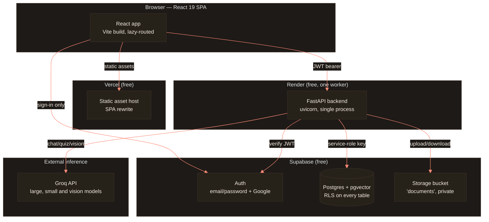
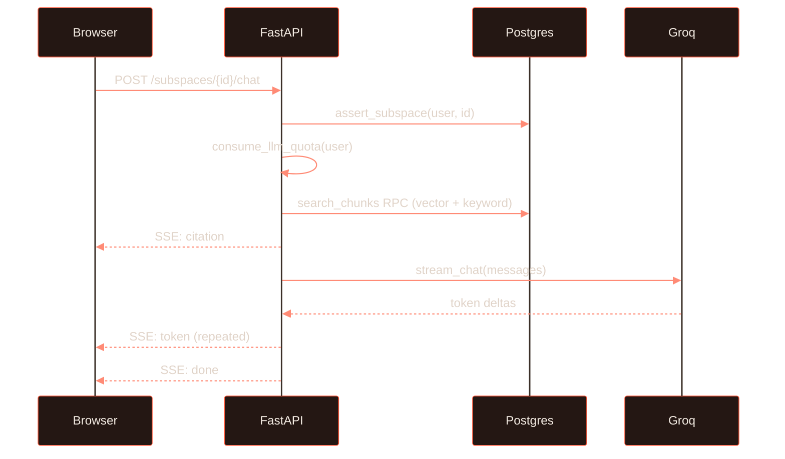
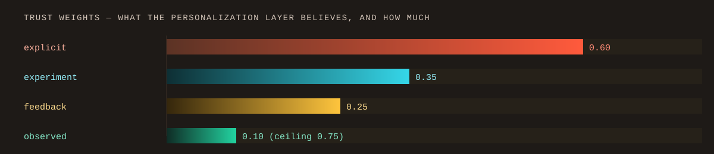

<div align="center">



**A study assistant that answers only from your own documents, shows the page each
claim came from, and turns answers into notes, flashcards and quizzes.**

[](LICENSE)
[](api/pyproject.toml)
[](web/package.json)
[](#run-it)

[RAG pipeline](#the-rag-pipeline) · [Agents](#agents) · [Evaluation](#evaluation) · [Decisions](#decisions-and-their-costs) · [Limitations](#known-limitations) · [Run it](#run-it)

</div>

## At a glance

| | |
|---|---|
| **What** | Retrieval-augmented chat over a student's own PDFs, notes and scans, plus agents that write quizzes, flashcards and notes from it |
| **Retrieval** | Layout-aware chunking, local BGE-small embeddings, vector + keyword search fused in one SQL call. The evidence reaches the model on **93.9%** of benchmark questions |
| **Answers** | **91.7%** judged correct on a graded sample. Citation precision is **67.6%**, the weakest number and the current focus |
| **Agents** | Quiz (plan, write, check, verify), flashcards (FSRS-5 scheduling), notes, user-written Skills, and a student model that feeds results back |
| **Cost** | $0 infrastructure. The free model tier serves the whole app about 3 answers a minute, and the system is built around that limit |
| **Proof** | [One re-runnable evaluation report](api/eval/REPORT.md), 822 backend and 1,218 frontend tests |

This is an AI engineering project first. The interesting work is in retrieval,
grounding, agent workflows, guardrails and measuring whether any of it works.
What it does badly is written down next to what it does well.

## What it is

Students put their own material into Subjects and Topics, then ask questions.
The model answers only from those files and marks each claim with the page it
came from. Any answer can become a note, a deck of flashcards or a quiz, and the
results of those feed a student model that shapes the next explanation.



<details>
<summary><b>What it looks like</b></summary>



<sub>A mockup in the app's own design system, not a screenshot. The panels light up in the order a document moves through them.</sub>

</details>

## Architecture


```mermaid
%%{init: {'theme':'base', 'themeVariables': {
  'primaryColor': '#262119', 'primaryTextColor': '#f5ede4', 'primaryBorderColor': '#ff5a3c',
  'lineColor': '#ff8b76', 'secondaryColor': '#0e2f34', 'tertiaryColor': '#1e1a17',
  'background': '#1e1a17', 'mainBkg': '#262119', 'nodeBorder': '#3b3028',
  'clusterBkg': '#1e1a17', 'clusterBorder': '#3b3028', 'edgeLabelBackground': '#1e1a17',
  'fontFamily': 'Courier New, monospace', 'fontSize': '13px'
}}}%%
flowchart TB
    subgraph Client["Browser — React 19 SPA"]
        UI[React app<br/>Vite build, lazy-routed]
    end

    subgraph Vercel["Vercel (free)"]
        Static[Static asset host<br/>SPA rewrite]
    end

    subgraph Render["Render (free, one worker)"]
        API[FastAPI backend<br/>uvicorn, single process]
    end

    subgraph Supabase["Supabase (free)"]
        Auth[Auth<br/>email/password + Google]
        PG[(Postgres + pgvector<br/>RLS on every table)]
        Storage[Storage bucket<br/>'documents', private]
    end

    subgraph External["External inference"]
        Groq[Groq API<br/>large, small and vision models]
    end

    UI -- "sign-in only" --> Auth
    UI -- "static assets" --> Static
    UI -- "JWT bearer" --> API
    API -- "service-role key" --> PG
    API -- "verify JWT" --> Auth
    API -- "upload/download" --> Storage
    API -- "chat/quiz/vision" --> Groq
```


The browser never talks to the database or the model. Every privileged operation
goes through the API, which is the only component holding credentials. The API
uses a service-role key that bypasses row-level security, so ownership is
enforced in code, and a test fails the build if a new route skips the check.

<details>
<summary><b>A chat turn, sequenced</b> — the highest-traffic request in the app</summary>


```mermaid
%%{init: {'theme':'base', 'themeVariables': {
  'primaryColor': '#262119', 'primaryTextColor': '#f5ede4', 'primaryBorderColor': '#ff5a3c',
  'lineColor': '#ff8b76', 'background': '#1e1a17', 'mainBkg': '#262119',
  'actorBkg': '#241713', 'actorBorder': '#ff5a3c', 'actorTextColor': '#f5ede4',
  'actorLineColor': '#3b3028', 'signalColor': '#ff8b76', 'signalTextColor': '#e0d3c8',
  'labelBoxBkgColor': '#0e2f34', 'labelBoxBorderColor': '#35d6e8', 'labelTextColor': '#f5ede4',
  'noteBkgColor': '#34260c', 'noteBorderColor': '#ffc53d', 'noteTextColor': '#ffdd8f',
  'activationBkgColor': '#22320f', 'activationBorderColor': '#b8ff3c',
  'sequenceNumberColor': '#1e1a17', 'fontFamily': 'Courier New, monospace', 'fontSize': '13px'
}}}%%
sequenceDiagram
    participant U as Browser
    participant A as FastAPI
    participant D as Postgres
    participant G as Groq

    U->>A: POST /subspaces/{id}/chat
    A->>D: assert_subspace(user, id)
    A->>A: consume_llm_quota(user)
    A->>D: search_chunks RPC (vector + keyword)
    A-->>U: SSE: citation
    A->>G: stream_chat(messages)
    G-->>A: token deltas
    A-->>U: SSE: token (repeated)
    A-->>U: SSE: done
```

Citations are computed **before** the model call and streamed first — the
frontend renders source cards while the answer is still arriving, and
retrieval failure is handled as its own state rather than silently degrading
into a hallucinated answer.

</details>


## The RAG pipeline

One path per question. The search-side stages were each kept because removing
them measurably hurt ([ablation](api/eval/ABLATION.md)); the numbers are in the table.

| Stage | What it does | Why | Code |
|---|---|---|---|
| **Read** | Reads headings and pages from a PDF's fonts and layout. Scanned pages go to a vision model | A citation can say "p. 4 · Satisfying 2NF" instead of "chunk 17" | `pdf_layout.py`, `ocr.py` |
| **Isolate** | Parses each PDF in a separate process with time and memory limits | A crafted PDF can fail its own upload, never the server | `pdf_worker.py` |
| **Chunk** | Splits by structure. A chunk stays inside its section, except that very short sections are folded into the next | Retrieved text is a coherent unit | `chunking.py` |
| **Embed** | BGE-small, run locally, stored at half precision (`halfvec`) | No embedding API, half the storage, identical benchmark scores | `embeddings.py` |
| **Resolve** | Rewrites a follow-up ("which one?") into a standalone question with a small model | Follow-ups reaching the model fall from 83% to 56% without it | `query_resolver.py` |
| **Search** | Vector and keyword search in one SQL function, rank-fused | Exact terms and reworded questions both land. Without keyword search, exact-term hits fall from 92% to 80% | `retrieval.py`, `search_chunks` |
| **Judge** | Decides whether the documents cover the question. Unsure matches are passed with a warning | Unsupported answers on uncovered questions fell from 12 of 14 to 0 of 13 | `retrieval.py` |
| **Answer** | Streams the answer with `[[n]]` markers; citation cards are sent before the first token | The student sees the sources while the answer arrives | `rag.py`, `subspace_chat.py` |
| **Verify** | After the stream: converts other citation styles, strips markers that point nowhere, moves ones on the wrong source | A marker that resolves to nothing is a broken promise | `rag.py` |

Clicking a citation opens the cited passage with the text highlighted. Each
answer can also end with one suggested follow-up, written by the same model call
and filtered out of the stream, so it costs no extra request.



## Agents

| Agent | Workflow | What keeps it honest |
|---|---|---|
| **Quiz** | Plan coverage across the document, write, check for repeats and malformed items, verify each answer against its source with a second model, repair what was dropped | Questions the verifier rejects are dropped. If the verifier itself fails, questions ship marked as unchecked. Repeated quizzes move through sections instead of reusing the same passages |
| **Flashcards** | Written from sources spread over the file, each card naming the passage it came from | Scheduled with FSRS-5, implemented in Python and TypeScript and held together by a 504-case parity test |
| **Notes** | Writes a note from an answer, or edits inside a note on request | Every note records whether a person, the AI, or both have touched it |
| **Skills** | Teaching styles a student writes themselves, switched on per topic | Wrapped and placed mid-prompt, so a Skill can change how things are explained but cannot outrank the honesty rules |
| **Student model** | Weak topics and concepts derived at read time from quiz answers and reviews | A concept needs three questions before it counts. Observed habits are labelled as observed, never stated as fact |

<div align="center">

</div>

<sub>How much each source of evidence about a student is trusted when preferences are blended.</sub>

## Guardrails and trust boundaries

- **Grounding.** With sources, the model may only use them. Without, it must say
  so in one sentence rather than answer from general knowledge.
- **Prompt order is the mechanism.** Style rules come first, a student's Skill in
  the middle, honesty and safety rules last, because a model treats the last
  constraint as the most specific. An earlier order let a Skill override grounding.
- **Untrusted input stays data.** Text inside an uploaded image is content to
  describe, never an instruction. Pasted images are limited to PNG, JPEG, WebP and GIF; SVG is left out because it can carry script.
- **Narrow safety rules.** Only operational harm is refused. Pathogens, exploits
  and wars are coursework, and an over-refusing tutor is a worse product.
- **Small blast radius.** Retrieval is scoped to one owner's topic, and the model
  has no tools, shell or network. An injected instruction can change what is
  said, not what is done.
- **Ownership.** Foreign ids return 404, not 403, so existence isn't leaked.

## Operating inside a free tier

The model provider allows 8,000 tokens a minute and 200,000 a day per model,
shared by every student. Measured, that is **2.3–3.2 answers a minute and 58–79
a day**. The controls are sized against that number.

| Control | What it does | Effect |
|---|---|---|
| Per-student allowance | 30 answers in a rolling 24 hours; failed and cached answers aren't charged | One student can't spend everyone's day |
| Answer cache | Reuses a stored answer only for the same student, topic, sources and settings; never for a follow-up, image or regenerate | A re-asked question costs no tokens |
| History budget | Newest answer kept nearly whole, older ones trimmed, stale citation markers removed | 9,444 → 3,418 tokens in a 40-message chat |
| Rules on demand | Short answer-shape and diagram rules for simple questions | About 430 tokens saved per simple turn |
| Model tiers | Large model for answers, quizzes and cards; small one for rewrites, verification, summaries and note edits | The small model's allowance is separate |
| Planned degradation | Chat moves to the small model when the large one has used 90% of its day | An answer instead of an error |

<div align="center">

</div>

## Evaluation

Everything below comes from [`api/eval/REPORT.md`](api/eval/REPORT.md), rebuilt by
`uv run python -m eval.report`. The benchmark is 114 questions (direct, reworded,
follow-up, exact-term, cross-section and unanswerable) over six Wikipedia PDFs,
searched through the production SQL function on a local PostgreSQL with pgvector.
Questions are scored against quotes from the source, so results don't depend on
how documents are chunked.

**Retrieval**

| Measure | Result |
|---|---|
| Right passage ranked first | 69.4% |
| Right passage in the top five | 90.8% |
| Evidence reached the model | 93.9% (72% before the retrieval rebuild) |
| All parts of a multi-part answer reached it | 91.8% |
| Search time, median / 95th percentile | 9.7 ms / 13.8 ms on a laptop, not on the production host |

**Answers** (36-question sample, graded against reference answers by a second model)

| Measure | Result |
|---|---|
| Correct | 91.7% |
| Made an unsupported claim | 8.3% |
| Refused when the documents don't cover the question | 50.0% |
| Citations pointing at the right passage | **67.6%** |

The last two are what the newest prompt changes target. Those changes are
shipped and not yet re-measured.

<details>
<summary><b>More results</b>: prompt and model comparison, agents, system</summary>

**Prompt and model choices** (18 questions each, same sources, same judge)

| Arm | Correct | Unsupported | Citations right |
|---|---|---|---|
| Large model, original prompt | 88.9% | 5.6% | 71.4% |
| Large model, shorter prompt (shipped) | 88.9% | 5.6% | 94.1% |
| Small model, shorter prompt | 88.9% | 11.1% | 79.0% |

The shorter prompt cost nothing in correctness, so it shipped. The small model
doubled the unsupported claims, so chat stays on the large one. Eighteen
questions can rule a change out; they cannot prove one in.

**Agents**

| | Result |
|---|---|
| Flashcards (3 topics, 8 cards each) | 24 of 24 kept and sourced, 0 repeats, 23 of 24 phrased as questions |
| Flashcard wording found in the cited passage | 46–50% by word overlap, with no earlier number to compare to |
| Quiz questions, graded by an independent model | 5 of 5 sound on two topics. On the third, the single-prompt quiz scored 0 of 5 and the workflow's quiz was not graded, so this result is incomplete |

**System**

| | Result |
|---|---|
| Prompt, plain question / one needing structure | about 2,200 / 2,600 tokens with six sources |
| Answer cache | 8 of 8 cases correct: hits a re-asked question, never another student, topic, source set or setting |
| Our own code per turn | prompt build 1.1 ms, cache lookup 0.08 ms |
| Small model, time to first word | about 0.9 s. The large model's live latency is not measured yet |

</details>

## Decisions and their costs

Every choice below gave something up. Rejected ideas are listed with the measurement that rejected them.

<details>
<summary><b>The decisions</b></summary>

| Decision | Why | Cost accepted |
|---|---|---|
| Local BGE-small, not a larger or hosted embedder | Fits a 512 MB host with no per-request cost. BGE-M3's weights alone are four times the memory ceiling | A lower retrieval ceiling |
| Hybrid search in one SQL function | One round trip, real Postgres ranking, measurable against the benchmark | Search logic lives in a migration |
| Guards in code, not row-level security | The API's key bypasses RLS, so RLS can't be the boundary | A missed check is silent, so a test enforces coverage |
| One worker, in-process limits and caches | The free host gives one process | Limits reset on deploy and don't span instances |
| A hand-written `httpx` data client | Intended to use less memory than the SDK (not measured) | More code to maintain |
| Honesty rules last in the prompt | A user's Skill can't override grounding | The prompt prefix isn't cacheable |
| FSRS-5 in two languages | The review screen previews the next interval before the save lands | Two implementations, kept equal by a parity test |

</details>

**Tried, measured, rejected:** trimming passages to matching sentences (7.5%
fewer characters, but it lost the evidence on 2 of 98 questions); reordering the
prompt for caching (a one-off check showed no cached tokens reported on this model; no saved result); the
small model for chat (twice the unsupported claims); a stored concept graph
(a normalized tag aggregated at read time does the job).

## When things fail

The model, the parser, retrieval and the host each have a planned failure path.

<details>
<summary><b>What happens when each one fails</b></summary>

| Failure | What happens |
|---|---|
| The large model is rate-limited or down | Retries before the first token only, then falls back to the small model. A circuit breaker skips a model known to be failing |
| The large model's day is nearly spent | Chat goes to the small model deliberately |
| Retrieval finds nothing relevant | The sources are passed with a warning, or not at all, and the model is told to say the material doesn't cover it. On the benchmark it did so half the time |
| A PDF hangs or balloons the parser | Its process is killed at the time limit, or fails at the memory limit. Only that upload fails, with a retry button |
| A citation points at nothing | It is removed before the answer is stored |
| A student exceeds their allowance | A plain message says when the next answer frees up |
| The host is cold | The first request waits roughly 30 to 60 seconds (not measured). Accepted, to stay inside the free instance hours |

</details>

One lesson learned the hard way: migrations are applied by hand, and a migration
that dropped a function the deployed API still called took chat down until the
matching code shipped. Additive migrations go first; anything that removes
something goes after the deploy.

## Known limitations

- Citation precision is 67.6%, and refusals on uncovered questions are 50%.
- The benchmark is six Wikipedia articles, not real lecture notes or scans.
- Notes are not evaluated, and the quiz evaluation is incomplete on one topic.
- No load testing against the deployed service, and no monitoring beyond logs.
- Rate limits and caches are in memory: per process, and reset on deploy.
- Concept matching is exact-string, so "mitochondria" and "the mitochondria" differ.
- Chat is desktop-only. Phones get notes, flashcards and quizzes.

<div align="center">

</div>

## Run it

[](https://vercel.com/new/clone?repository-url=https%3A%2F%2Fgithub.com%2FAbiram116%2FNew-Space-Learn&root-directory=web&project-name=space-learn)
[](https://render.com/deploy?repo=https://github.com/Abiram116/New-Space-Learn)

Locally you need Node.js (LTS), Python 3.11–3.12, a free
[Supabase](https://supabase.com) project and a free [Groq](https://console.groq.com) key:

```bash
git clone https://github.com/Abiram116/New-Space-Learn.git
cd New-Space-Learn
cp .env.example .env       # fill in the Supabase and Groq keys
npm run dev                # backend and frontend together
```

Migrations are in `supabase/migrations/` and are applied by hand in the Supabase
SQL editor. [`docs/operations/setup.md`](docs/operations/setup.md) has the full walkthrough.

```bash
cd web && npm test                     # 1,218 frontend tests
cd api && uv run --extra dev pytest    # 822 backend tests
cd api && uv run python -m eval.report --free   # prompt size, caches, capacity (no model calls)
```

## Repo

```
web/         React 19, TypeScript, Vite, Tailwind    → Vercel
api/         FastAPI and the AI pipeline              → Render
api/eval/    benchmark, evaluation scripts, REPORT.md
supabase/    Postgres + pgvector migrations
docs/        architecture, decisions, setup
```

| | |
|---|---|
| **AI** | Groq (`gpt-oss-120b`, `gpt-oss-20b`, a vision model), local BGE-small via `fastembed` |
| **Backend** | FastAPI (async, one worker), Pydantic v2, `httpx` |
| **Data** | Supabase: Postgres + pgvector, Auth, Storage |
| **Frontend** | React 19, TypeScript, Vite, Tailwind CSS v4, Tiptap, KaTeX |

Pipeline code is in `api/app/services/`. More depth:
[architecture](docs/engineering/architecture.md) ·
[AI pipeline](docs/engineering/ai-pipeline.md) ·
[personalization](docs/engineering/personalization.md) ·
[security](docs/engineering/security.md) ·
[decisions](docs/decisions.md) ·
[evaluation](api/eval/REPORT.md).

Before a PR: tests pass, `npm run build` succeeds, `ruff` and `oxlint` are clean,
and any route taking a caller-supplied id proves ownership.

## License

MIT, see [LICENSE](LICENSE).
