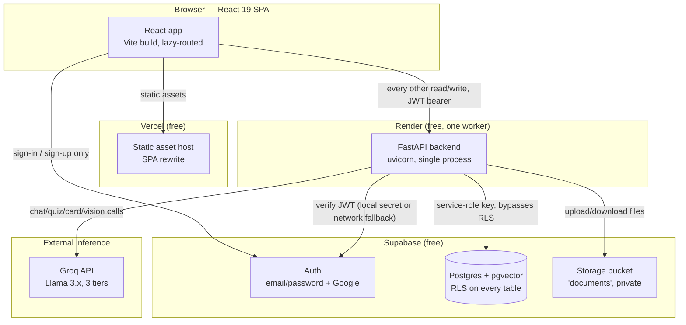
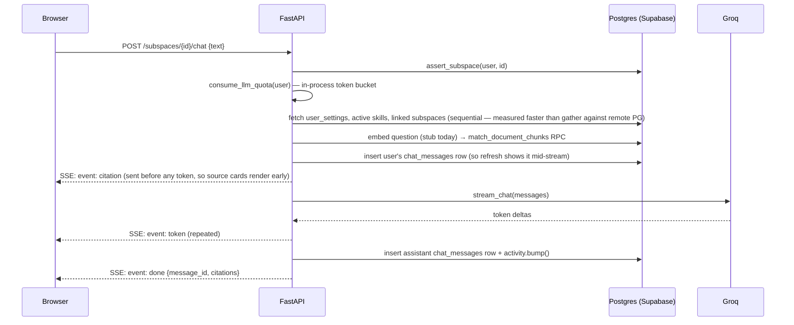

# System Architecture

> **Relationship to `architecture.md`:** that document is the "how" — repo
> layout, the frontend/backend/DB contract, the design system, day-to-day
> onboarding. This document is the "why" — component boundaries, data flow,
> the trade-off behind each subsystem, and where the architecture actually
> breaks under scale. Read `architecture.md` first if you're new to the repo;
> read this one to understand why it's shaped the way it is. Neither
> document repeats the other's content on purpose.

---

## 1. Component diagram



**The one rule that explains most of this diagram:** the browser never talks
to Postgres or Groq directly. Everything privileged funnels through the
backend, which is the only thing holding real credentials. This is a
security boundary first, an architecture choice second — see `SECURITY.md`.

---

## 2. Data flow — the two flows that matter

### 2.1 The study loop (product-level)

```
INGEST (upload) → INTERROGATE (chat) → CONSOLIDATE (notes) → REHEARSE (cards) → PROVE (quizzes)
                                              ↓
                                    THE MAP (SOUL.md — what to do next)
```

Every one of these is a subspace-scoped request. Nothing crosses a subspace
boundary unless the student explicitly created a `subspace_links` row — see
`architecture.md`'s data-model section. This is also why the SOUL.md redesign
didn't need a new subsystem: the loop was already the product; the redesign
only changed how "the Map" step computes its answer (tag aggregation, not a
graph).

### 2.2 The request-authorization flow (system-level)

Every authenticated request follows the same shape, enforced identically
everywhere via `api/app/guards.py`:

1. Frontend attaches the Supabase-issued JWT as `Authorization: Bearer <token>`.
2. `deps.get_current_user()` verifies it — locally via `SUPABASE_JWT_SECRET`
   when possible, falling back to a network call to Supabase Auth when the
   project uses newer asymmetric signing keys (`setup.md` documents why both
   paths exist).
3. The router calls the matching `assert_*` guard (`assert_subspace`,
   `assert_deck`, `assert_space`) with the caller-supplied id — this is the
   *real* authorization boundary, because step 4 uses a key that ignores RLS.
4. Only after the guard passes does the handler touch Postgres, using the
   Supabase **service-role key**.

RLS still exists on every table (`supabase/migrations/*_rls.sql`) and is
correct defense-in-depth, but it is not what's actually stopping a
cross-user read today — the guard is. This is deliberate, documented, and
covered as its own decision in `SECURITY.md` and `ADR-0004`.

---

## 3. API flow — two representative sequences

### 3.1 A chat turn (the highest-traffic request in the app)



Citations are computed **before** the model call and streamed to the client
before the first token — the frontend can render source cards while the
answer is still arriving. This is a UX decision with a system consequence:
retrieval failure must be handled before generation starts, not caught
after — which is exactly what `NothingIndexed` (see `errors.py`) enforces.

### 3.2 Document upload (the other latency-sensitive path)

```
POST /subspaces/{id}/documents
  → assert_subspace (ownership)
  → validate (non-empty, ≤20MB)
  → insert row (status=uploading)   ← client sees the doc immediately
  → upload bytes to Storage         → status=processing
  → extract text (PDF/CSV/plain/vision-transcribed image)
  → chunk_text()                    (900-char windows, paragraph-aware)
  → embed_texts()                   (stubbed today — see AI_ENGINE.md §1)
  → delete old chunks, insert new   (reprocess-safe)
  → status=ready
```

Bounded by `PROCESSING_BUDGET_S = 25` (`documents.py`) — if embedding takes
longer, the document is left `processing` with a message pointing at the
`/documents/{id}/reprocess` endpoint, rather than the request hanging until
Render's own timeout kills it. **This is the load-bearing design response to
"no background workers"**: a document that can't finish in one request
finishes on the *next* request instead of needing a queue.

---

## 4. Service boundaries and why each one exists

| Subsystem | Owns | Why it exists here and not elsewhere |
|---|---|---|
| **React SPA (Vercel)** | UI, client-side routing, optimistic updates, the session cache | Static hosting is free and has no cold start — the landing page and shell load instantly even when the backend is asleep. |
| **FastAPI (Render)** | All AI orchestration, all privileged writes, ownership guards, rate limiting | The one place holding the Groq key and the Supabase service-role key. If the browser held either, both would be extractable from the client bundle — a hard security requirement, not a style choice. |
| **Supabase Auth** | Identity, session issuance, OAuth | Building password hashing, session rotation, and OAuth handshakes from scratch would be pure risk for zero product value — this is the textbook case for buying instead of building. |
| **Postgres + pgvector (Supabase)** | System of record for every table, plus vector similarity search | One database instead of a separate vector store: at this data volume (a few thousand chunks per user), a dedicated vector DB (Pinecone, Weaviate) would add a network hop and a second free-tier account to manage for no measurable latency win. |
| **Supabase Storage** | Original uploaded files | Kept so `reprocess` can re-run extraction without asking the student to re-upload — the raw bytes are cheap to keep, re-asking a student for a file they already gave you is not free (in trust, if not in dollars). |
| **Groq** | Inference only, no state | Chosen for free-tier speed and three model sizes on one key (§ `architecture.md`). Stateless by design — swapping providers only touches `llm.py`'s `LLM` protocol, never a router. |

---

## 5. Trade-offs, stated explicitly

| Decision | What it costs | What it buys | Reconsider when |
|---|---|---|---|
| Single Render worker, no background jobs | Every document embeds inline, capped at 25s; nothing runs "later" | Zero infrastructure to operate, zero queue to monitor, zero worker-crash class of bug | Concurrent uploads from multiple real users start timing out regularly (not yet observed — there's one real user) |
| Service-role key bypasses RLS; guards are the real authorization | A missed `assert_*` call is a silent cross-user leak, not a loud RLS error | One request can touch multiple tables without re-authenticating per table — much simpler router code | Never, on this architecture — the fix is discipline (and tests — see the audit finding in `backlog.md`), not switching back to RLS-as-primary |
| In-process rate limiter (a dict, not Redis) | Resets on every deploy; doesn't work across >1 worker | No extra service, no extra free-tier account, correct for exactly the "one worker" constraint that defines this whole stack | The day Render's plan changes to >1 worker — `ratelimit.py`'s docstring already says so |
| httpx-based hand-rolled Supabase client instead of the official `supabase-py` SDK | More code to maintain in `services/supabase.py`; no SDK convenience methods | Measurably smaller memory footprint on a 512MB instance — the reason free-tier survives at all | The free-tier RAM ceiling is lifted, or the SDK's footprint improves enough to matter less than the maintenance cost |
| One Postgres database for both relational data and vectors | `ivfflat` index quality degrades below a few thousand rows (documented in the migration itself) and shares the 500MB cap with every other table | No second system, no second bill, no second thing that can be down | Total embedded chunks across all users approach the point where index quality or storage actually becomes the bottleneck — not close today |

---

## 6. Future scalability — what breaks first, and the upgrade path

Ordered by which limit is actually closest to being hit:

1. **Stubbed embeddings** (see `AI_ENGINE.md §1`, `backlog.md`) — not a scale
   problem, a correctness problem, and it's first because everything else on
   this list only matters once retrieval is real.
2. **In-process rate limiter and single-worker assumption** — the first real
   scale wall. Upgrade path: move the token bucket to a shared store
   (Postgres table with an upsert-and-check, avoiding a new Redis
   dependency) *before* increasing worker count, since the limiter silently
   stops working correctly the moment there's more than one process.
3. **`ivfflat` index quality** — needs "a few thousand rows" per the
   migration's own comment to beat a full scan. Fine per-subspace at today's
   volumes; revisit the `lists` parameter once a single subspace's chunk
   count grows an order of magnitude.
4. **Supabase 500MB free tier** — the hard ceiling. `document_chunks.content`
   (raw chunk text, stored once) will be the largest consumer as usage
   grows. Upgrade path is a paid Supabase tier, not a schema change — the
   schema already avoids storing text redundantly (SOUL.md's tag-based
   redesign keeps this true: tags are a few bytes per row, not a copy of
   anything).
5. **Render free-tier cold start (~30s)** — already mitigated for the
   *landing* page (health-ping warm-up, per `SOUL.md §10`); still a real
   first-request tax for a student who bookmarks the app directly. Upgrade
   path is a paid Render instance with no cold start, which is a monthly
   cost decision, not an architecture one.

None of these require a different architecture — every upgrade path above is
"pay for a bigger version of the same piece," which is exactly what a
free-tier-first design is supposed to leave you with.
