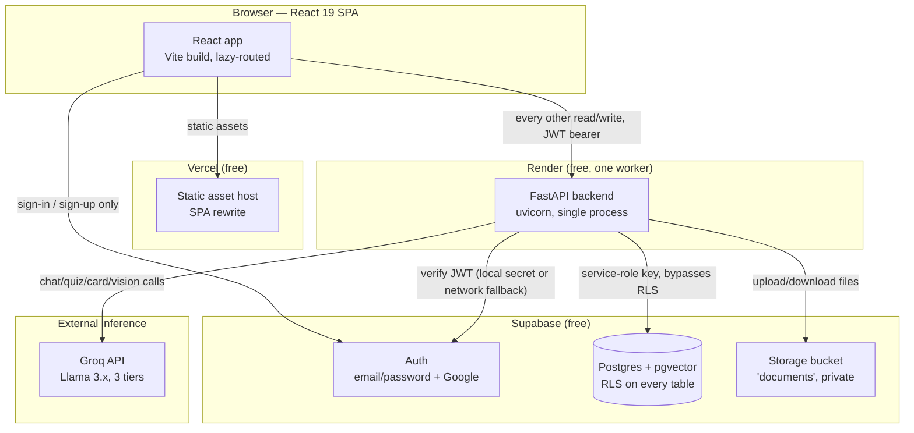
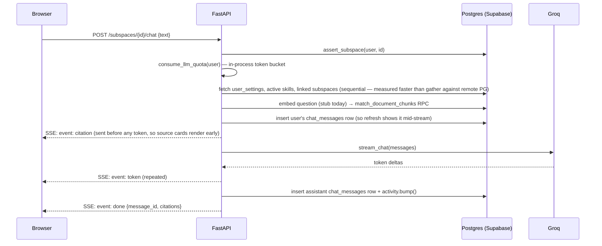

# Architecture

The whole system in one document: the repo layout and day-to-day contract
first, then the component boundaries, data flows, and trade-offs behind them.

This used to be two files, `architecture.md` and `SYSTEM_ARCHITECTURE.md`,
split along a "how" / "why" line. The split cost every reader a decision
about which one to open and produced two tables of contents for one system,
so they were merged.

## Repo layout

```
web/         React 19 + Vite + TS + Tailwind v4   → Vercel
api/         FastAPI + uv (async, singletons)     → Render (free tier)
supabase/    Postgres + pgvector + RLS migrations → Supabase
render.yaml  Backend deploy manifest
docs/        You are here
```

## The data model: Subjects → Subspaces

Everything in the product hangs off this two-level hierarchy:

- A **Subject** is a broad area the student is studying ("Reinforcement
  Learning"). It carries a tone color (one of `brand / sky / mint / sun /
  coral / azure / jade`) that identifies it everywhere in the UI — the rail,
  card accents, badges.
- A **Subspace** is a specific topic inside that subject ("Markov decision
  processes"). Every document, chat message, note, deck, and quiz belongs to
  exactly one subspace.

Nothing crosses subspace boundaries today — a chat in one topic can't see
documents indexed in another. That's a deliberate default described further
in [../plan.md](../plan.md) (cross-context knowledge sharing is an open,
unscheduled idea, not a limitation nobody noticed).

## The contract between frontend, backend, and database

- **The frontend never calls Groq or the database directly.** It talks to
  Supabase Auth for sign-in/sign-up only, and to the FastAPI backend for
  every other read and write.
- **The backend owns all AI orchestration** (retrieval → prompt construction
  → streaming the model's reply → persisting citations) and every privileged
  write. It authenticates using the Supabase **service role key**, which
  bypasses Row Level Security entirely.
- **Because the service key bypasses RLS, RLS is a second line of defense,
  not the primary one.** Every backend handler that accepts a caller-supplied
  id (a `subspace_id`, a `deck_id`) must prove the caller owns that row
  before touching it — via the shared helpers in `api/app/guards.py`. A
  route that skips this reintroduces cross-user data leaks; this has
  happened before and was fixed (see `assert_subspace` / `assert_deck`
  call sites for the pattern to copy).
- **The database is the source of truth.** Every table is scoped to
  `user_id = auth.uid()` via Row Level Security, defined in
  `supabase/migrations/`.

## Free-tier discipline (backend)

Render's free tier gives 512MB RAM, one CPU, and spins the service down
after 15 minutes of inactivity. The backend is written to that budget on
purpose:

- **Single uvicorn worker.** No multiprocessing.
- **Module-level singletons** for the httpx client, the Supabase wrapper,
  and the Groq client — created once per process, reused for every request.
- **All I/O is async.** No blocking calls in a request path.
- **Streaming responses** for chat (Server-Sent Events) so a long model
  reply never sits fully buffered in memory.
- **No background workers.** Document embedding runs inline inside the
  upload request, capped at 25 seconds; a `reprocess` endpoint lets a
  timed-out document finish on a second call instead of needing a queue.

## Error handling contract

Every backend error — expected or not — returns the same JSON envelope:

```json
{ "error": { "code": "unauthorized", "message": "Please sign in again." } }
```

Codes in use: `unauthorized`, `forbidden`, `not_found`, `validation_error`,
`rate_limited`, `upstream_unavailable`, `not_configured`, `internal_error`.
The frontend's `friendlyMessage()` (`web/src/api/errors.ts`) maps every one
of these to plain-English toast copy. **No raw error, stack trace, or
provider error body is ever allowed to reach the screen** — this is a hard
rule, not a preference, because a provider's error text can carry account or
quota details that shouldn't be user-visible.

## Missing configuration never crashes the app

If `GROQ_API_KEY` or the Supabase keys aren't set:

- The frontend shows a friendly `ConfigMissing` card instead of a blank
  screen or a thrown error.
- The backend's `StubLLM` (`api/app/services/llm.py`) streams a canned "AI
  isn't configured yet" reply, so the whole chat UI stays clickable and
  testable without a real key.
- `USE_STUB_EMBEDDINGS=true` inserts deterministic pseudo-vectors instead of
  calling a real embedding provider, so upload → chunk → retrieve still
  works end-to-end with no embedding key.

## The AI layer

- **LLM Protocol** (`api/app/services/llm.py`): `GroqLLM` and `StubLLM` both
  implement the same `stream_chat` interface, so swapping providers or
  degrading gracefully never touches route code.
- **Model tiering** — one Groq key, three models chosen per request so cheap
  work doesn't pay 70B latency or quota:

  | Setting | Default | Used for |
  |---|---|---|
  | `GROQ_MODEL` | `llama-3.3-70b-versatile` | RAG chat, quiz generation |
  | `GROQ_MODEL_FAST` | `llama-3.1-8b-instant` | short, low-stakes prompts (e.g. the Home re-entry brief) |
  | `GROQ_MODEL_VISION` | `qwen/qwen3.6-27b` | image input — configured but not yet wired to a feature |

  Groq retires model ids periodically; confirm current ones against
  `GET /openai/v1/models` before changing these.

- **RAG** (`api/app/services/rag.py`): `retrieve()` calls the
  `match_document_chunks` Postgres function (cosine similarity over
  pgvector embeddings, scoped to one subspace); `build_prompt()` assembles
  the system message, the retrieved source snippets with citation markers,
  recent chat history, and any active Skill's instructions.
- **Quota protection** (`api/app/services/ratelimit.py`): a per-user
  in-process token bucket in front of every LLM-backed endpoint — 20 burst,
  refilling 20/minute. In-process because the free tier runs a single
  worker; if that ever changes, this needs a shared store (Redis or
  Postgres) instead.
- **Groq error mapping**: a 429 from Groq becomes our `rate_limited` code
  (tells the user to wait), not a generic outage; a 401/403 becomes
  `not_configured` (the key is wrong, and the user can't fix that from the
  app). Provider error bodies are logged, never surfaced.

## The design system ("Foil Binder")

The frontend's visual identity is a deliberate choice, not a default theme:
a warm, dark, trading-card-collection world where the product's own atom (a
question-and-answer pair) and the visual atom (a card) are the same object.
Concretely:

- **Dark only**, warm ground (`#1E1815`), never nearing black.
- **No violet** — the original wireframe's brand color was explicitly
  rejected during the redesign.
- **Foil accent tones** (`brand/sky/mint/sun/coral/azure/jade`) double as
  both a Subject's color identity and a badge's rarity tier.
- **Real drawn icons** (`web/src/components/ui/Icon.tsx`, ~33 icons) — no
  emoji as iconography anywhere in the product UI.
- **Typography**: Big Shoulders Display (condensed caps, used for
  "nameplate" headings), Manrope (body), JetBrains Mono (small print, set
  codes, citations — the `.setcode` class).

Every card in the app — a flashcard, a deck tile, a quiz card, a badge — is
built on the shared `cardstock` CSS class (`web/src/index.css`), so a new
card-shaped surface should reuse that instead of inventing new elevation/
border treatment.

## Repo tour

- **`web/src/api/`** — the only place that talks HTTP. `client.ts` is the
  fetch wrapper (auth header, error envelope parsing, network-failure
  normalization). One file per resource (`spaces.ts`, `chat.ts`, etc).
- **`web/src/auth/`** — `AuthProvider` owns the Supabase session;
  `RequireAuth` / `RedirectIfAuthed` are the route guards.
- **`web/src/components/ui/`** — small primitives with no app-specific
  logic: `Button`, `Card`, `Modal`, `Toast`, `Input`, `EmptyState`,
  `Skeleton`, `ConfirmDialog`, `Icon`, `Logo`.
- **`web/src/features/`** — one folder per feature; each owns its views and
  local helpers. `features/spaces/SpacesProvider` is the one piece of
  genuinely global state — the sidebar's space tree — since every screen
  needs it.
- **`web/src/features/landing/motion.tsx`** — the motion primitives written
  for this app's own visual grammar (`DealText`, `FoilText`,
  `usePointerParallax`) rather than pulled from a generic animation library.
- **`api/app/main.py`** — the FastAPI factory: CORS, exception handlers,
  router registration, the client-shutdown lifespan.
- **`api/app/services/`** — `supabase.py` (httpx-based Supabase wrapper —
  deliberately not the official SDK, to save memory on the free tier),
  `llm.py`, `embeddings.py`, `rag.py`, `ratelimit.py`, `activity.py`
  (streak/badge bookkeeping, consolidated from three near-duplicate copies
  that used to live in different routers).
- **`api/app/routers/`** — one file per domain; every handler is `async`
  and every error goes through the shared JSON envelope.
- **`api/app/guards.py`** — the ownership-assertion helpers every router
  must call before touching a caller-supplied row id.
- **`supabase/migrations/`** — timestamped and additive-only; never edit an
  already-applied migration, add a new one.

## What isn't built yet (intentional gaps, not oversights)

- Account deletion — no backend endpoint. Settings says so plainly instead
  of showing a button that doesn't work.
- Background reminder notifier — the preference persists, but firing one
  needs a scheduled worker the free tier won't run reliably.
- Cross-subject knowledge transfer — sequenced as Phase 5 of
  [../plan.md](../plan.md).

Everything else still unbuilt is sequenced in
[../plan.md](../plan.md); it is the only list.

---

## Component diagram



**The one rule that explains most of this diagram:** the browser never talks
to Postgres or Groq directly. Everything privileged funnels through the
backend, which is the only thing holding real credentials. This is a
security boundary first, an architecture choice second — see `docs/engineering/security.md`.

---

## Data flow — the two flows that matter

### The study loop (product-level)

```
INGEST (upload) → INTERROGATE (chat) → CONSOLIDATE (notes) → REHEARSE (cards) → PROVE (quizzes)
                                              ↓
                                    THE MAP (../product/vision.md — what to do next)
```

Every one of these is a subspace-scoped request. Nothing crosses a subspace
boundary unless the student explicitly created a `subspace_links` row — see
`docs/engineering/architecture.md`'s data-model section. This is also why the ../product/vision.md redesign
didn't need a new subsystem: the loop was already the product; the redesign
only changed how "the Map" step computes its answer (tag aggregation, not a
graph).

### The request-authorization flow (system-level)

Every authenticated request follows the same shape, enforced identically
everywhere via `api/app/guards.py`:

1. Frontend attaches the Supabase-issued JWT as `Authorization: Bearer <token>`.
2. `deps.get_current_user()` verifies it — locally via `SUPABASE_JWT_SECRET`
   when possible, falling back to a network call to Supabase Auth when the
   project uses newer asymmetric signing keys (`setup.md` documents why both
   paths exist).
3. The router calls the matching `assert_*` guard (`assert_subspace`,
   `assert_deck`, `assert_space`) with the caller-supplied id — this is the
   *real* authorization boundary, because step 4 uses a key that ignores RLS.
4. Only after the guard passes does the handler touch Postgres, using the
   Supabase **service-role key**.

RLS still exists on every table (`supabase/migrations/*_rls.sql`) and is
correct defense-in-depth, but it is not what's actually stopping a
cross-user read today — the guard is. This is deliberate, documented, and
covered as its own decision in `docs/engineering/security.md` and `docs/decisions.md`.

---

## API flow — two representative sequences

### A chat turn (the highest-traffic request in the app)



Citations are computed **before** the model call and streamed to the client
before the first token — the frontend can render source cards while the
answer is still arriving. This is a UX decision with a system consequence:
retrieval failure must be handled before generation starts, not caught
after — which is exactly what `NothingIndexed` (see `errors.py`) enforces.

### Document upload (the other latency-sensitive path)

```
POST /subspaces/{id}/documents
  → assert_subspace (ownership)
  → validate (non-empty, ≤20MB)
  → insert row (status=uploading)   ← client sees the doc immediately
  → upload bytes to Storage         → status=processing
  → extract text (PDF/CSV/plain/vision-transcribed image)
  → chunk_text()                    (900-char windows, paragraph-aware)
  → embed_texts()                   (stubbed today — see ai-pipeline.md §1)
  → delete old chunks, insert new   (reprocess-safe)
  → status=ready
```

Bounded by `PROCESSING_BUDGET_S = 25` (`documents.py`) — if embedding takes
longer, the document is left `processing` with a message pointing at the
`/documents/{id}/reprocess` endpoint, rather than the request hanging until
Render's own timeout kills it. **This is the load-bearing design response to
"no background workers"**: a document that can't finish in one request
finishes on the *next* request instead of needing a queue.

---

## Service boundaries and why each one exists

| Subsystem | Owns | Why it exists here and not elsewhere |
|---|---|---|
| **React SPA (Vercel)** | UI, client-side routing, optimistic updates, the session cache | Static hosting is free and has no cold start — the landing page and shell load instantly even when the backend is asleep. |
| **FastAPI (Render)** | All AI orchestration, all privileged writes, ownership guards, rate limiting | The one place holding the Groq key and the Supabase service-role key. If the browser held either, both would be extractable from the client bundle — a hard security requirement, not a style choice. |
| **Supabase Auth** | Identity, session issuance, OAuth | Building password hashing, session rotation, and OAuth handshakes from scratch would be pure risk for zero product value — this is the textbook case for buying instead of building. |
| **Postgres + pgvector (Supabase)** | System of record for every table, plus vector similarity search | One database instead of a separate vector store: at this data volume (a few thousand chunks per user), a dedicated vector DB (Pinecone, Weaviate) would add a network hop and a second free-tier account to manage for no measurable latency win. |
| **Supabase Storage** | Original uploaded files | Kept so `reprocess` can re-run extraction without asking the student to re-upload — the raw bytes are cheap to keep, re-asking a student for a file they already gave you is not free (in trust, if not in dollars). |
| **Groq** | Inference only, no state | Chosen for free-tier speed and three model sizes on one key (§ `docs/engineering/architecture.md`). Stateless by design — swapping providers only touches `llm.py`'s `LLM` protocol, never a router. |

---

## Trade-offs, stated explicitly

| Decision | What it costs | What it buys | Reconsider when |
|---|---|---|---|
| Single Render worker, no background jobs | Every document embeds inline, capped at 25s; nothing runs "later" | Zero infrastructure to operate, zero queue to monitor, zero worker-crash class of bug | Concurrent uploads from multiple real users start timing out regularly (not yet observed — there's one real user) |
| Service-role key bypasses RLS; guards are the real authorization | A missed `assert_*` call is a silent cross-user leak, not a loud RLS error | One request can touch multiple tables without re-authenticating per table — much simpler router code | Never, on this architecture — the fix is discipline (and tests — see the audit finding in `docs/plan.md`), not switching back to RLS-as-primary |
| In-process rate limiter (a dict, not Redis) | Resets on every deploy; doesn't work across >1 worker | No extra service, no extra free-tier account, correct for exactly the "one worker" constraint that defines this whole stack | The day Render's plan changes to >1 worker — `ratelimit.py`'s docstring already says so |
| httpx-based hand-rolled Supabase client instead of the official `supabase-py` SDK | More code to maintain in `services/supabase.py`; no SDK convenience methods | Measurably smaller memory footprint on a 512MB instance — the reason free-tier survives at all | The free-tier RAM ceiling is lifted, or the SDK's footprint improves enough to matter less than the maintenance cost |
| One Postgres database for both relational data and vectors | `ivfflat` index quality degrades below a few thousand rows (documented in the migration itself) and shares the 500MB cap with every other table | No second system, no second bill, no second thing that can be down | Total embedded chunks across all users approach the point where index quality or storage actually becomes the bottleneck — not close today |

---

## Future scalability — what breaks first, and the upgrade path

Ordered by which limit is actually closest to being hit:

1. **Stubbed embeddings** (see `docs/engineering/ai-pipeline.md §1`, `docs/plan.md`) — not a scale
   problem, a correctness problem, and it's first because everything else on
   this list only matters once retrieval is real.
2. **In-process rate limiter and single-worker assumption** — the first real
   scale wall. Upgrade path: move the token bucket to a shared store
   (Postgres table with an upsert-and-check, avoiding a new Redis
   dependency) *before* increasing worker count, since the limiter silently
   stops working correctly the moment there's more than one process.
3. **`ivfflat` index quality** — needs "a few thousand rows" per the
   migration's own comment to beat a full scan. Fine per-subspace at today's
   volumes; revisit the `lists` parameter once a single subspace's chunk
   count grows an order of magnitude.
4. **Supabase 500MB free tier** — the hard ceiling. `document_chunks.content`
   (raw chunk text, stored once) will be the largest consumer as usage
   grows. Upgrade path is a paid Supabase tier, not a schema change — the
   schema already avoids storing text redundantly (../product/vision.md's tag-based
   redesign keeps this true: tags are a few bytes per row, not a copy of
   anything).
5. **Render free-tier cold start (~30s)** — already mitigated for the
   *landing* page (health-ping warm-up, per `docs/product/vision.md §10`); still a real
   first-request tax for a student who bookmarks the app directly. Upgrade
   path is a paid Render instance with no cold start, which is a monthly
   cost decision, not an architecture one.

None of these require a different architecture — every upgrade path above is
"pay for a bigger version of the same piece," which is exactly what a
free-tier-first design is supposed to leave you with.
